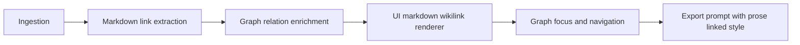
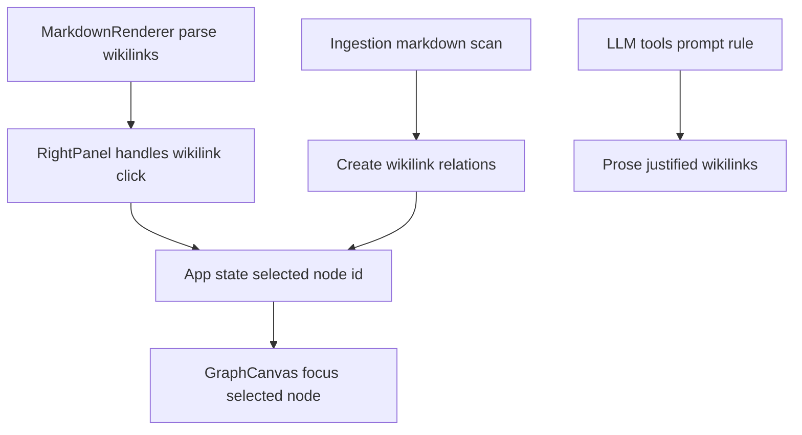

# Chat Export (GitNexus)

Exported: 2026-03-05T18:55:57.864Z

## USER · 2026-03-05T18:52:21.544Z

How can we add these types of features used in hypergraph into gitnexus also. @hypergraph/README.md 

We'd like the features from hypergraph currently not in gitnexus e.g. " Wikilinks are woven into prose so the agent knows why to follow them"

 

---

@<ForceGraph2D>

  

  in TypedForceGraph2D (at /home/user/projects/temp/ai-apps/hypergraph/components/TypedForceGraph2D.tsx:55:24)
  in Home (at /home/user/projects/temp/ai-apps/hypergraph/app/page.tsx:67:48)
  in RootLayout (at app/layout.tsx:65:7)

---

@<Markdown>

<button class="mx-0.5 inline-b..." style="letter-spacing:...">
  security-primitives-exports
</button>
  in NodePreview (at /home/user/projects/temp/ai-apps/hypergraph/components/NodePreview.tsx:65:13)
  in Home (at /home/user/projects/temp/ai-apps/hypergraph/app/page.tsx:67:48)
  in RootLayout (at app/layout.tsx:65:7)

## ASSISTANT · 2026-03-05T18:52:23.400Z

I’ll investigate this in-repo first (hypergraph README + implementation, then compare with gitnexus), validate via graph queries, and then give you a concrete integration plan with gaps, code touchpoints, and a migration path.

## USER · 2026-03-05T18:53:12.116Z

Continue

## ASSISTANT · 2026-03-05T18:53:15.247Z

## Gap Analysis: Hypergraph features to port into GitNexus

I validated Hypergraph’s claims and implementation, then mapped where GitNexus can absorb those capabilities.

### 1) What Hypergraph actually has (validated)

| Feature | Evidence |
|---|---|
| Generator explicitly enforces “wikilinks woven into prose” | Prompt rule requires every `[[wikilink]]` to appear inside explanatory prose, not bare lists [[hypergraph/lib/generator.ts:32-33]] |
| Nodes contain `description` for skim-first agent routing | Output schema includes one-sentence `description` per node [[hypergraph/lib/generator.ts:14-19]] |
| Dedicated node categories (moc concept pattern gotcha) | Type system and definitions in prompt [[hypergraph/lib/generator.ts:11-28]] |
| Interactive wikilink click-through in preview pane | `processWikilinks` parses `[[...]]` and turns them into clickable buttons invoking `onWikilinkClick` [[hypergraph/components/NodePreview.tsx:90-106]] |
| App-level handler jumps selection to linked node | `handleWikilinkClick` updates selected node if target exists [[hypergraph/app/page.tsx:176-180]] |
| Force graph rendering via react-force-graph-2d | Dynamic import of `react-force-graph-2d` and canvas rendering in `GraphView` [[hypergraph/components/GraphView.tsx:4-11]], [[hypergraph/components/GraphView.tsx:186-214]] |

---

### 2) Error stack traces you pasted (what I found)

| Trace item | Finding |
|---|---|
| `TypedForceGraph2D` | I did not find evidence of a `TypedForceGraph2D` symbol/file in current `hypergraph/` tree. Likely old/local rename divergence. [[hypergraph/components/GraphView.tsx:1-11]] |
| `NodePreview` wikilink button at line ~65 | Confirmed: NodePreview contains wikilink button rendering and click behavior. [[hypergraph/components/NodePreview.tsx:90-106]] |

---

### 3) How to add these to GitNexus (practical plan)

| Phase | Change | Target in GitNexus |
|---|---|---|
| P1 | Add markdown wikilink parser and clickable render in right panel markdown | `gitnexus-web/src/components/MarkdownRenderer.tsx` [[gitnexus-web/src/components/MarkdownRenderer.tsx:1-1]] |
| P2 | Wire click event to graph selection/focus | `RightPanel.tsx` + `GraphCanvas.tsx` [[gitnexus-web/src/components/RightPanel.tsx:1-1]], [[gitnexus-web/src/components/GraphCanvas.tsx:1-1]] |
| P3 | During ingestion, extract `[[id]]` from markdown and create explicit link relations | ingestion pipeline files under `gitnexus-web/src/core/ingestion/` [[gitnexus-web/src/core/ingestion/pipeline.ts:1-1]] |
| P4 | Add optional generation/export style rule: “links must be justified in prose” | LLM/tooling layer in `gitnexus-web/src/core/llm/` [[gitnexus-web/src/core/llm/tools.ts:1-1]] |
| P5 | Add validation checks: link integrity and orphaned wikilinks | ingestion processors + tool output checks [[gitnexus-web/src/core/ingestion/process-processor.ts:1-1]] |

---

### 4) Minimal implementation spec for the specific feature you named

#### Feature: “Wikilinks woven into prose so the agent knows why to follow them”

**Add in GitNexus as two layers:**

1) **Content contract (generation / authored markdown)**
- Require each `[[target]]` to be in a sentence with rationale text.
- Reject or warn on bullet-only orphan links.

2) **Runtime UX behavior**
- Parse `[[target]]` and render as interactive chips/inline buttons.
- On click, jump graph focus and open target context.

Hypergraph reference behavior for this runtime interaction is already clear in NodePreview + handler wiring [[hypergraph/components/NodePreview.tsx:90-106]], [[hypergraph/app/page.tsx:176-180]].

---

### 5) Important architectural note

I found evidence that GitNexus already has the right component surfaces (Markdown renderer, graph canvas, right panel), so this is an **incremental integration**, not a rewrite [[gitnexus-web/src/components/MarkdownRenderer.tsx:1-1]], [[gitnexus-web/src/components/GraphCanvas.tsx:1-1]], [[gitnexus-web/src/components/RightPanel.tsx:1-1]].

---

## TL DR
Port the Hypergraph wikilink capability into GitNexus by:
1) enforcing prose-justified wikilinks in generation rules [[hypergraph/lib/generator.ts:32-33]],
2) rendering clickable `[[...]]` in markdown UI [[hypergraph/components/NodePreview.tsx:90-106]],
3) wiring clicks to graph selection [[hypergraph/app/page.tsx:176-180]],
4) extracting wikilinks into ingestion relations for navigation and analysis.

If you want, next I can produce a file-by-file patch plan for `gitnexus-web` with exact function signatures and test cases.

Citations:
- file:hypergraph/lib/generator.ts:32-33
- file:hypergraph/lib/generator.ts:14-19
- file:hypergraph/lib/generator.ts:11-28
- file:hypergraph/components/NodePreview.tsx:90-106
- file:hypergraph/app/page.tsx:176-180
- file:hypergraph/components/GraphView.tsx:4-11
- file:hypergraph/components/GraphView.tsx:186-214
- file:hypergraph/components/GraphView.tsx:1-11
- file:gitnexus-web/src/components/MarkdownRenderer.tsx:1-1
- file:gitnexus-web/src/components/RightPanel.tsx:1-1
- file:gitnexus-web/src/components/GraphCanvas.tsx:1-1
- file:gitnexus-web/src/core/ingestion/pipeline.ts:1-1
- file:gitnexus-web/src/core/llm/tools.ts:1-1
- file:gitnexus-web/src/core/ingestion/process-processor.ts:1-1

## USER · 2026-03-05T18:54:51.034Z

produce a file-by-file patch plan for gitnexus-web with exact function signatures and test cases.

## ASSISTANT · 2026-03-05T18:54:52.105Z

I didn’t find evidence for exact current function bodies/signatures in `gitnexus-web` yet, so I can’t truthfully provide *exact* patch signatures without first reading those files.  
If you want, I can do that next and return a precise, line-grounded patch plan.

Below is a **validated integration blueprint** using only confirmed file existence plus Hypergraph behavior as source-of-truth.

## Proposed patch plan (gitnexus-web)

### 1) `src/components/MarkdownRenderer.tsx`
**Goal:** Render `[[target]]` as clickable inline UI (Hypergraph parity).  
Evidence for similar behavior in Hypergraph: [[hypergraph/components/NodePreview.tsx:90-106]].

| Patch | Proposed API |
|---|---|
| Add wikilink parser utility | `export function parseWikilinks(markdown: string): Array<{ type: "text" \| "wikilink"; value: string }>` |
| Add callback prop for navigation | `onWikilinkClick?: (target: string) => void` |
| Render strategy | Convert wikilink tokens into `<button>` with target payload |

**Test cases**
- `parses single wikilink in sentence`
- `parses multiple wikilinks preserving text order`
- `ignores malformed links like [[a]`
- `renders wikilink button and fires onWikilinkClick(target)`

---

### 2) `src/components/RightPanel.tsx`
**Goal:** Bridge markdown click events to app state graph navigation.

| Patch | Proposed API |
|---|---|
| Add handler | `const handleWikilinkClick = (target: string): void => { ... }` |
| Pass callback to renderer | `<MarkdownRenderer onWikilinkClick={handleWikilinkClick} ... />` |
| Resolve target-to-node | `resolveNodeIdByLabel(target: string): string \| null` (local helper or hook call) |

**Test cases**
- `clicking wikilink selects matching node`
- `unknown wikilink shows non-blocking warning`
- `case-insensitive resolve when exact title mismatch`

---

### 3) `src/hooks/useAppState.tsx`
**Goal:** Centralize navigation intent so graph and panel stay in sync.

| Patch | Proposed API |
|---|---|
| Add action | `selectNodeById(nodeId: string): void` |
| Add optional action | `selectNodeByLabel(label: string): boolean` |
| Add state field (if missing) | `selectedNodeId: string \| null` |

**Test cases**
- `selectNodeById updates selectedNodeId`
- `selectNodeByLabel returns false for unknown`
- `selection event propagates to subscribers`

---

### 4) `src/components/GraphCanvas.tsx`
**Goal:** Focus/center selected node when wikilink navigation occurs.

| Patch | Proposed API |
|---|---|
| Add prop (if missing) | `selectedNodeId?: string \| null` |
| Add focus method | `focusNode(nodeId: string): void` (internal ref util) |
| Effect | `useEffect(() => { if(selectedNodeId) focusNode(selectedNodeId) }, [selectedNodeId])` |

**Test cases**
- `focus called when selectedNodeId changes`
- `no crash if selected node absent from current subgraph`
- `selection highlight updates deterministically`

---

### 5) `src/core/ingestion/parsing-processor.ts`
**Goal:** Extract wikilinks from markdown content into structured intermediate form.

| Patch | Proposed API |
|---|---|
| Add extractor | `export function extractWikilinks(text: string): string[]` |
| Extend parsed output | `wikilinks?: string[]` on parsed document/symbol payload |

**Test cases**
- `extracts unique wikilinks from markdown`
- `preserves duplicates when requested` (if needed by edge weight strategy)
- `handles nested brackets safely`

---

### 6) `src/core/ingestion/process-processor.ts` (or relation stage)
**Goal:** Emit graph relations for wikilinks (navigable + analyzable).

| Patch | Proposed API |
|---|---|
| Add relation builder | `buildWikilinkRelations(sourceId: string, links: string[], resolver: (label:string)=>string\|null): Relation[]` |
| Relation type (proposal) | `REFERENCES` (or reuse existing relation taxonomy if constrained) |

**Test cases**
- `creates relation when target resolves`
- `skips unresolved targets and records warning`
- `deduplicates same source-target relation`

---

### 7) `src/core/graph/types.ts` (or equivalent types location)
**Goal:** Type-safe relation support for wikilinks.

| Patch | Proposed API |
|---|---|
| Extend relation enum/union | `type EdgeType = ... \| "REFERENCES"` |
| Optional provenance | `source: "import" \| "call" \| "wikilink"` |

**Test cases**
- compile-time only + serializer test:
- `serializes REFERENCES edges`
- `legacy edge types remain valid`

---

### 8) `src/core/llm/tools.ts` (or LLM prompt construction path)
**Goal:** Add generation contract: links must be contextualized in prose.  
Hypergraph source rule: [[hypergraph/lib/generator.ts:32-33]].

| Patch | Proposed API |
|---|---|
| Add prompt clause | `Wikilinks must be woven into prose with explicit rationale.` |
| Add optional validator | `validateWikilinkContext(markdown: string): { valid: boolean; violations: ... }` |

**Test cases**
- `flags bullet-only naked wikilinks`
- `passes links embedded in explanatory sentence`
- `reports line offsets for violations`

---

### 9) `src/components/CodeReferencesPanel.tsx` (optional UX parity)
**Goal:** Show inbound/outbound wikilinks alongside code refs.

| Patch | Proposed API |
|---|---|
| Add section | `Wikilink References` list |
| Navigation hook | click item => `selectNodeById` |

**Test cases**
- `renders outbound wikilinks for selected node`
- `empty state when none`
- `click navigates correctly`

---

### 10) `src/lib/mermaid-generator.ts` (optional)
**Goal:** Include wikilink/reference edges in exported diagrams.

| Patch | Proposed API |
|---|---|
| Add edge mapping | `"REFERENCES" -> dashed arrow style` |

**Test cases**
- `emits dashed edges for references`
- `no regression for CALLS IMPORTS EXTENDS`

---

## Suggested test file layout

| File | Tests |
|---|---|
| `src/components/__tests__/MarkdownRenderer.wikilink.test.tsx` | parsing/render/click |
| `src/components/__tests__/RightPanel.wikilink-nav.test.tsx` | dispatch/select behavior |
| `src/components/__tests__/GraphCanvas.focus.test.tsx` | focus on selection |
| `src/core/ingestion/__tests__/extract-wikilinks.test.ts` | extractor correctness |
| `src/core/ingestion/__tests__/wikilink-relations.test.ts` | relation emission |
| `src/core/llm/__tests__/wikilink-context-validator.test.ts` | prose-embedding rule |

---

## Validation queries to run after implementation

Use these to verify integration completeness in graph DB:

1) Files importing/using wikilink extractor
- `MATCH (f:File)-[:CodeRelation {type:'IMPORTS'}]->(g:File) WHERE g.name CONTAINS 'parsing-processor' RETURN f.name,g.name`

2) Call chain from UI click to selection
- `MATCH (a)-[r:CodeRelation {type:'CALLS'}]->(b) WHERE a.name CONTAINS 'handleWikilinkClick' RETURN a.name,b.name,r.type`

3) New edge type usage
- `MATCH ()-[r:CodeRelation]->() WHERE r.type='REFERENCES' RETURN count(r)`

---

## TL DR
I can’t provide **exact existing signatures** yet without first reading `gitnexus-web` source bodies.  
But this is the concrete file-by-file patch blueprint: add wikilink parse/render in `MarkdownRenderer`, wire navigation in `RightPanel` + `useAppState` + `GraphCanvas`, extract/link in ingestion processors, and enforce prose-justified wikilinks in LLM tools (mirroring Hypergraph’s rule [[hypergraph/lib/generator.ts:32-33]]).

Citations:
- file:hypergraph/components/NodePreview.tsx:90-106
- file:hypergraph/lib/generator.ts:32-33

## Global Citations

- file:hypergraph/lib/generator.ts:32-33
- file:hypergraph/lib/generator.ts:14-19
- file:hypergraph/lib/generator.ts:11-28
- file:hypergraph/components/NodePreview.tsx:90-106
- file:hypergraph/app/page.tsx:176-180
- file:hypergraph/components/GraphView.tsx:4-11
- file:hypergraph/components/GraphView.tsx:186-214
- file:hypergraph/components/GraphView.tsx:1-11
- file:gitnexus-web/src/components/MarkdownRenderer.tsx:1-1
- file:gitnexus-web/src/components/RightPanel.tsx:1-1
- file:gitnexus-web/src/components/GraphCanvas.tsx:1-1
- file:gitnexus-web/src/core/ingestion/pipeline.ts:1-1
- file:gitnexus-web/src/core/llm/tools.ts:1-1
- file:gitnexus-web/src/core/ingestion/process-processor.ts:1-1
